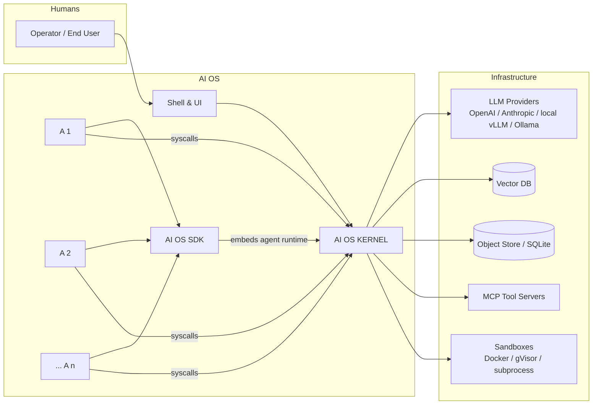

# 01 — Architecture Overview

**Status:** Draft (v0.1)
**Relates to:** all docs; read after `00-vision.md`.

---

## 1. System Context



## 2. Layered Architecture

```
┌────────────────────────────────────────────────────────────┐
│  L5  SHELL & UI        CLI shell · Web desktop · REST API   │
├────────────────────────────────────────────────────────────┤
│  L4  AGENT LAYER       AI OS SDK (syscall client)          │
│                        User agents · Framework adapters     │
├────────────────────────────────────────────────────────────┤
│  L3  KERNEL LAYER                                          │
│      ┌──────────┐ ┌───────────┐ ┌────────────┐             │
│      │ Scheduler│ │  Context  │ │  Memory    │             │
│      │ (agent/  │ │  Manager  │ │  Manager   │             │
│      │  llm/tool)│ └───────────┘ └────────────┘             │
│      ├──────────┤ ┌───────────┐ ┌────────────┐             │
│      │ Storage  │ │ IPC /     │ │  Tool      │             │
│      │ Manager  │ │ Msg Bus   │ │  Manager   │             │
│      ├──────────┤ └───────────┘ └────────────┘             │
│      │ Access   │ ┌───────────┐ ┌────────────┐             │
│      │ Control  │ │  Audit    │ │  LLM Core  │             │
│      │ Manager  │ │  Log      │ │  (gateway) │             │
│      └──────────┘ └───────────┘ └────────────┘             │
├────────────────────────────────────────────────────────────┤
│  L2  INFRASTRUCTURE   LLM gateways · vector DB · object     │
│                       store · MCP servers · sandbox runtimes│
├────────────────────────────────────────────────────────────┤
│  L1  HOST             OS kernel · GPU · network · filesystem│
└────────────────────────────────────────────────────────────┘
```

## 3. Kernel Modules

| Module | Responsibility | Key syscalls it serves |
|---|---|---|
| **Scheduler** | Runs agents; multiplexes LLM and tool requests; enforces budgets; does context switching | `spawn`, `yield`, `sleep`, `suspend`, `resume` |
| **Context Manager** | Owns each agent's context window: assembly, compression, summarization, eviction | `read_context`, `append_context`, `summarize_context` |
| **Memory Manager** | Tiered memory (L1/L2/L3 + shared pools); embeddings; retrieval | `read_memory`, `write_memory`, `search_memory` |
| **Storage Manager** | Checkpoints, artifacts, semantic file system | `checkpoint`, `store_artifact`, `fs_read`, `fs_write`, `fs_search` |
| **IPC / Msg Bus** | Mailboxes, pub/sub events, handoffs, synchronization | `send_msg`, `recv_msg`, `subscribe`, `publish`, `join` |
| **Tool Manager** | Tool registry, MCP client, sandboxed execution, retries/timeouts | `list_tools`, `call_tool`, `cancel_tool` |
| **Access Control** | RBAC, per-agent permissions, approval workflows, secret injection | `get_env`, `request_permission` |
| **Audit Log** | Immutable record of every syscall and state mutation | (kernel-internal) |
| **LLM Core** | Unified model gateway: routing, batching, rate limits, failover | `llm_generate` (kernel-internal) |
| **Agent Manager** | Process table, lifecycle state machine, PID allocation | part of `spawn`/`exit` |

## 4. Boot Sequence

1. **Config load** — read `aios.toml` (models, quotas, sandbox policy, RBAC roles).
2. **Infrastructure init** — connect to model gateway, vector DB, object store; verify MCP servers.
3. **Module init** — instantiate kernel modules in dependency order:
   Audit → Access Control → LLM Core → Storage → Memory → Context → Tool → IPC → Scheduler → Agent Manager.
4. **Process table restore** — if `--resume`, restore checkpoints of previously suspended agents.
5. **Shell start** — CLI or web desktop connects to the kernel control plane.
6. **Ready** — kernel accepts `spawn` syscalls from SDK/UI.

## 5. Happy-Path Data Flow (user launches an agent)

```
Operator ──launch(agent_spec)──▶ Shell ──spawn()──▶ Agent Manager
   │                                                 │ validate spec
   │                                                 ▼
   │                           Access Control ──check permissions──▶ allow/deny
   │                                                 │
   │                                                 ▼
   │                           Scheduler ──enqueue agent──▶ Context Manager
   │                                                         │ assemble initial
   │                                                         │ context (system
   │                                                         │ prompt + spec)
   │                                                         ▼
   │                           LLM Core ──generate()──▶ model provider
   │                                                         │
   │                         agent loop:                     │
   │            ┌─◀─ context appended (tool results, replies)─┘
   │            │
   │   tool? ──call_tool()──▶ Access Control ──▶ Tool Manager ──▶ MCP server
   │                                                           │
   │   msg?  ──send_msg()──▶ IPC bus ──▶ other agent's mailbox
   │   memo ──write_memory()──▶ Memory Manager ──▶ vector DB
   │   wait  ──recv_msg(timeout)──▶ scheduler blocks agent
   └──── exit()/terminate ──▶ checkpoint ──▶ audit log
```

## 6. Module Interaction Rules

1. Agents **never** touch modules directly — only via syscalls (see `02-kernel.md` for the ABI).
2. Kernel modules may call each other, but only along the dependency order in §4 (no cycles).
3. The Scheduler is the only module that may start/suspend/stop agents; the Context Manager is
   the only module that mutates context; the Tool Manager is the only module that executes tools.
4. All privileged operations funnel through Access Control first.
5. Every state mutation is written to the Audit Log before being acknowledged.

## 7. Key Design Tenets (enforced in later docs)

- **Syscall ABI is the contract.** Everything agent-facing is a versioned syscall.
- **One scheduler, three queues.** Agent runs are scheduled; their LLM calls and tool calls are
  separately scheduled resources (see `03-scheduler.md`).
- **Memory is tiered and kernel-owned.** See `04-memory.md`.
- **State is resumable.** Any agent can be checkpointed at any point (see `05-storage.md`).
- **Security is deny-by-default.** See `08-security.md`.