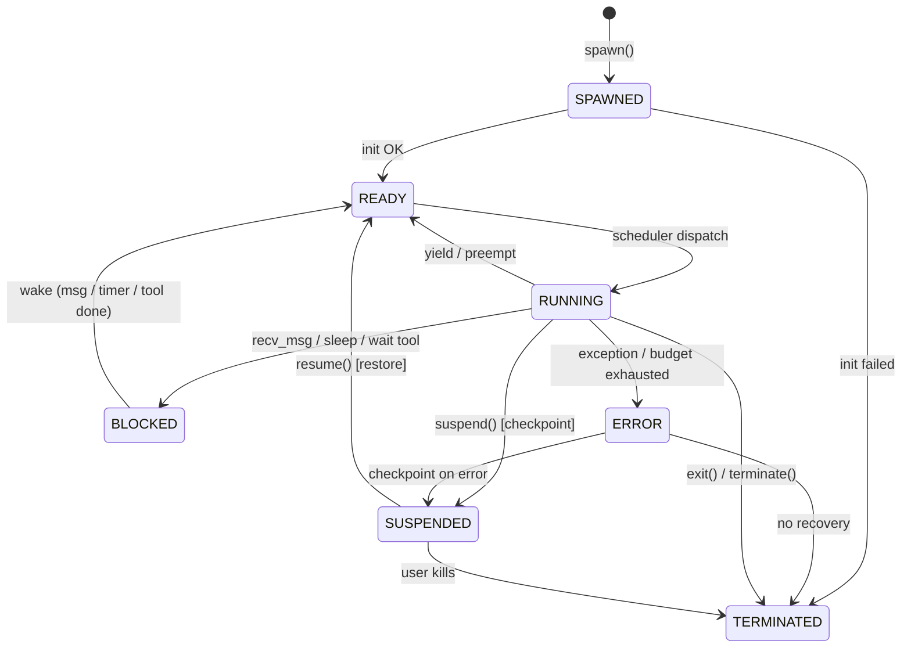

# 02 — Kernel & Agent Model

**Status:** Draft (v0.1)
**Canonical for:** agent spec schema, syscall ABI, lifecycle state machine.
**Relates to:** `01-overview.md`, `03-scheduler.md`, `09-sdk.md`.

---

## 1. Kernel Responsibilities

The kernel is the only trusted computing base inside AI OS. It owns:

- **Identity & lifecycle** — every agent has a PID, an owner, and a lifecycle state.
- **The syscall ABI** — the only way agents interact with system resources.
- **Resource accounting** — tokens, cost, wall-clock, storage, tool calls.
- **Module arbitration** — no agent (or module) bypasses another module's authority.

## 2. The Agent Process Model

Each agent is represented by an **Agent Control Block (ACB)**, analogous to a PCB in a classic OS:

```jsonc
// AgentControlBlock (kernel-internal)
{
  "pid": 42,
  "spec_ref": "specs/research_analyst.json",
  "owner": "user:prom",
  "state": "RUNNING",              // lifecycle state, §3
  "priority": 50,                  // 0–100, higher = preferred
  "parent_pid": 1,                 // spawning agent or shell (PID 1 = shell)
  "group_id": 7,                   // scheduling group (fair-share unit)
  "budgets": {                     // enforced by scheduler
    "tokens_per_min": 40_000,
    "cost_per_hour_usd": 5.0,
    "max_wall_clock_s": 3600
  },
  "resource_usage": { "tokens": 123456, "cost_usd": 0.42, "tool_calls": 87 },
  "context_ref": "ctx/42",         // owned by Context Manager
  "memory_ref":  "mem/42",         // owned by Memory Manager
  "mailbox_ref": "mb/42",          // owned by IPC Manager
  "checkpoint_ref": null,          // owned by Storage Manager
  "sandbox_ref": "sbx/42",         // isolation context (permissions, namespace)
  "started_at": "2026-08-19T09:00:00Z",
  "last_heartbeat": "2026-08-19T09:01:12Z"
}
```

## 3. Lifecycle State Machine



| State | Meaning | Preemption point? |
|---|---|---|
| `SPAWNED` | ACB created, spec validated, sandbox not ready | n/a |
| `READY` | On the run queue, waiting for CPU (a scheduler slot) | n/a |
| `RUNNING` | Actively executing its agent loop | yes — between LLM turns |
| `BLOCKED` | Waiting on IPC, sleep, or a tool result | yes |
| `SUSPENDED` | Checkpointed; not on any queue | yes |
| `ERROR` | Exception or budget exhaustion; recovery in progress | yes |
| `TERMINATED` | Final state; ACB retained for audit, resources released | n/a |

**Invariant:** *Every agent is checkpointable in any non-terminal state.* The Context Manager +
Memory Manager + Storage Manager cooperate to serialize a complete snapshot.

## 4. Agent Spec (the declaration of an agent)

Every agent is launched from a **validated agent spec** — the closest thing to a compiled binary
in AI OS. The SDK validates specs against JSON Schema before `spawn`.

```jsonc
{
  "schema_version": "1.0",
  "name": "research-analyst",
  "description": "Researches a topic and writes a markdown brief.",
  "model": {
    "provider": "openai-compatible",   // gateway-routed
    "model_id": "gpt-4o",
    "temperature": 0.2
  },
  "system_prompt": "You are a careful research analyst...",
  "tools": ["web.search", "fs.read", "fs.write"],   // allowlist (deny by default)
  "memory": {
    "working_memory_size": 8000,        // tokens of scratchpad
    "long_term": { "enabled": true, "index": "research", "access": "read-write" },
    "shared_pools": [ { "pool": "company_knowledge", "access": "read" } ]
  },
  "ipc": {
    "can_send_to": ["*"],               // restrict to group if needed
    "can_subscribe": ["research.done", "human.approval"]
  },
  "budgets": {
    "tokens_per_min": 40000,
    "cost_per_hour_usd": 5.0,
    "max_wall_clock_s": 3600,
    "max_tool_calls": 200
  },
  "permissions": {
    "role": "standard",                 // RBAC role, see 08-security.md
    "needs_approval_for": ["fs.write", "code.exec"]
  },
  "checkpoint": { "policy": "every_turn", "max_snapshots": 10 }
}
```

**Validation rules (non-exhaustive):**
- `tools` must be a subset of the kernel's registered tool registry.
- `budgets` must not exceed the owner's group quota (kernel enforces).
- `permissions.role` must be resolvable; inherited capabilities are merged, never widened.
- `memory.shared_pools[].access` ∈ {`read`, `read-write`}.
- Specs are immutable at runtime; changes require a new spawn.

## 5. Syscall ABI (canonical)

Agents (via the SDK) invoke syscalls by name against the kernel. The ABI is **versioned**
(`abi_version` in the spec). Syscalls are grouped by the module that serves them.

| # | Syscall | Args (JSON) | Returns | Module |
|---|---|---|---|---|
| 1 | `spawn` | `{spec, parent_pid}` | `{pid}` | Agent Manager |
| 2 | `exit` | `{status, message?}` | `{ok}` | Agent Manager |
| 3 | `get_pid` | — | `{pid, parent_pid, group_id}` | Agent Manager |
| 4 | `yield` | `{hint?}` | `{ok}` | Scheduler |
| 5 | `sleep` | `{ms}` | `{woke_at}` | Scheduler |
| 6 | `suspend` | `{reason?}` | `{checkpoint_id}` | Scheduler/Storage |
| 7 | `resume` | `{pid}` | `{ok}` | Scheduler/Storage |
| 8 | `get_status` | `{pid?}` | `{state, usage, checkpoint}` | Agent Manager |
| 9 | `read_context` | — | `{messages, tokens}` | Context Manager |
| 10 | `append_context` | `{role, content}` | `{tokens}` | Context Manager |
| 11 | `summarize_context` | `{target_tokens?}` | `{summary, tokens_saved}` | Context Manager |
| 12 | `write_memory` | `{namespace, key, value, ttl?}` | `{ok}` | Memory Manager |
| 13 | `read_memory` | `{namespace, key}` | `{value}` | Memory Manager |
| 14 | `search_memory` | `{query, namespace?, top_k, min_score?}` | `{hits[]}` | Memory Manager |
| 15 | `forget_memory` | `{namespace, key?}` | `{deleted}` | Memory Manager |
| 16 | `send_msg` | `{to_pid, body, reply_to?}` | `{msg_id}` | IPC |
| 17 | `recv_msg` | `{timeout_ms, filter?}` | `{msg?}` | IPC |
| 18 | `subscribe` | `{topic}` | `{ok}` | IPC |
| 19 | `unsubscribe` | `{topic}` | `{ok}` | IPC |
| 20 | `publish` | `{topic, payload}` | `{delivered}` | IPC |
| 21 | `join` | `{pids[], timeout_ms?}` | `{results[]}` | IPC (sync) |
| 22 | `list_tools` | `{query?}` | `{tools[]}` | Tool Manager |
| 23 | `call_tool` | `{tool, args}` | `{result, meta}` | Tool Manager |
| 24 | `cancel_tool` | `{call_id}` | `{ok}` | Tool Manager |
| 25 | `checkpoint` | `{label?}` | `{checkpoint_id}` | Storage Manager |
| 26 | `store_artifact` | `{path, data, mime?}` | `{artifact_id}` | Storage Manager |
| 27 | `fs_read` | `{path}` | `{content, meta}` | Storage Manager |
| 28 | `fs_write` | `{path, content, mime?}` | `{meta}` | Storage Manager |
| 29 | `fs_search` | `{query, top_k?}` | `{hits[]}` | Storage Manager (semantic FS) |
| 30 | `get_env` | `{key}` | `{value}` | Access Control (secrets vault) |
| 31 | `request_permission` | `{action, resource, reason}` | `{approved, ticket}` | Access Control |
| 32 | `get_usage` | — | `{tokens, cost, tool_calls, wall_clock}` | Resource accounting |
| 33 | `set_budget` | `{budgets}` | `{ok}` | Scheduler (privileged) |
| 34 | `log` | `{level, message}` | `{ok}` | Audit (agent-facing) |

**Design rules:**
- All args and returns are JSON. Binary payloads are referenced by artifact IDs (`store_artifact`).
- `read_*` syscalls never expose secrets; secrets only via `get_env` with a resolved permission.
- Syscall failure returns `{error: {code, message}}` where `message` is generic to the caller;
  the detailed trace goes to the audit log only (see `08-security.md`).
- Every syscall is audited with: `{ts, pid, syscall, args_hash, result, duration_ms}`.

## 6. Error Handling

| Error code | Meaning |
|---|---|
| `E_PERM` | Permission denied (deny by default) |
| `E_BUDGET` | Token/cost/wall-clock budget exhausted |
| `E_QUOTA` | Group quota exhausted |
| `E_NOENT` | Key, tool, pool, or agent not found |
| `E_BUSY` | Resource in use / transient contention |
| `E_TIMEOUT` | Deadline exceeded (recv, join, tool) |
| `E_INVAL` | Malformed syscall args (validated against schema) |
| `E_AGENT` | Target agent in incompatible state |
| `E_ABORT` | Cancelled by operator or cancellation of a tool call |
| `E_INTERNAL` | Kernel fault — agent should checkpoint and retry |

Agents must treat **all** errors as first-class: the SDK exposes them as typed exceptions and the
kernel guarantees no state corruption on failure (syscalls are atomic per ACB).

## 7. ABI Versioning

- `abi_version` is negotiated at spawn; the kernel supports the last two minor versions.
- Adding a syscall = minor bump (backward compatible). Changing semantics = major bump.
- Deprecated syscalls are marked `deprecated` for one minor version, then removed.

## 8. Syscall Execution Model

1. Agent (SDK) calls e.g. `aios.call_tool("web.search", {...})`.
2. SDK validates args against the syscall's JSON Schema (client-side fast fail → `E_INVAL`).
3. Kernel **Access Control** checks: is `web.search` in the agent's allowlist? budget OK? group
   quota OK? needs approval? → `E_PERM` / `E_BUDGET` / `E_QUOTA` or an approval ticket.
4. Kernel dispatches to the serving module, which executes **atomically** (no partial state).
5. Result is written to the audit log, resource usage is charged, and the reply is returned.

Steps 3–5 are the *only* path; there is no direct/undocumented channel to kernel resources.

## 9. Kernel Invariants (enforced by tests)

1. **ACB uniqueness** — PIDs are never reused while an ACB exists; monotonic, no collision.
2. **State legality** — only the transitions in §3 are permitted; no illegal jumps.
3. **Budget hard-stop** — the scheduler *always* suspends an agent on `E_BUDGET`, never relies on
   the agent's cooperation.
4. **Checkpoint completeness** — a checkpoint is only marked `committed` after context + memory +
   working state + sandbox metadata are all durably written.
5. **Audit immutability** — the audit log is append-only; tamper-evident via hash chaining.
6. **No module bypass** — unit tests enforce that no kernel module imports another module's
   internal API; all cross-module calls go through defined interfaces.

## 10. Kernel / SDK Boundary

```
┌─────────────────────────────────────────┐
│ AGENT CODE          (user code, sandbox)│
│   python agent using `import aios`      │
├─────────────────────────────────────────┤
│ AI OS SDK          (syscall client)     │
│   syscall() → JSON-RPC over local IPC   │
│   or in-process call into kernel        │
├─────────────────────────────────────────┤
│ AI OS KERNEL      (trusted)             │
│   modules from §1 of 01-overview.md     │
└─────────────────────────────────────────┘
```

- **In-process mode:** SDK and kernel share a process; syscalls are direct async calls (fast).
- **Out-of-process mode:** agents run in sandboxes and reach the kernel over a local socket
  using the same JSON-RPC framing — identical ABI, enabling isolation.
- The SDK is the *only* library agents import; it is a thin, dependency-light client.