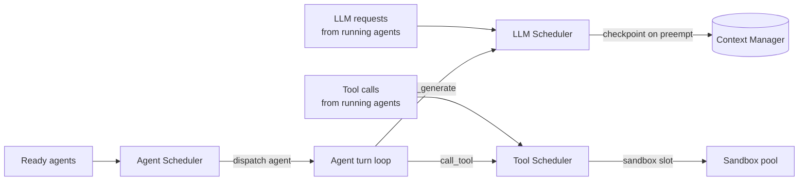

# 03 — Scheduler

**Status:** Draft (v0.1)
**Relates to:** `02-kernel.md` (syscalls 4–7, 33), `04-memory.md`, `07-tools.md`.

---

## 1. Why Scheduling Is Central

Agents compete for three kinds of resources that a classic scheduler never had to manage:

1. **LLM generation slots** — a model is a shared, slow, expensive resource (tokens/sec).
2. **Context space** — resident context is finite; preemption requires checkpointing it.
3. **Tool execution capacity** — sandbox slots, rate limits, external API quotas.

Unmanaged, agents degenerate into a free-for-all: hot agents starve cold ones, one runaway agent
burns the whole budget, and bursty tool calls trip external rate limits. The scheduler's job is
**fair, governed, preemptible allocation** of all three.

## 2. One Scheduler, Three Queues



| Tier | Decides | Enforces |
|---|---|---|
| **Agent Scheduler** | *which agent runs its next turn* | priorities, fair share, wall-clock budgets |
| **LLM Scheduler** | *which LLM request goes to which model backend* | token budgets, rate limits, provider failover, batching |
| **Tool Scheduler** | *which tool call executes, when, and where* | concurrency caps, per-tool rate limits, timeouts |

## 3. Agent Scheduler

### 3.1 Inputs per agent
- Priority (0–100, from spec, may be adjusted by operator)
- Group weight (fair-share denominator)
- Waiting time since last run
- Resource usage so far (anti-starvation bias)
- Declared preemption tolerance (`checkpoint.policy`: `every_turn` | `manual` | `never`)

### 3.2 Algorithm (v1: hierarchical weighted fair-queueing)

```
1. Group level:  pick the group with max (weight · deficit / consumed_weight)
                 — weighted fair queuing across groups (e.g. teams, tenants).
2. Agent level:  within the group, pick highest (priority, waiting_time) agent.
3. Preemption:   a lower-priority RUNNING agent is preempted if a higher-priority agent
                 has waited > preempt_threshold AND the low agent is at a preemption point
                 (between LLM turns). Preemption forces suspend → checkpoint → requeue.
```

**Preemption points** (invariant from `02-kernel.md` §3): an agent may only be preempted
*between* LLM turns, never mid-generation and never mid-tool-call (tool calls are themselves
managed by the Tool Scheduler and are cancelable at defined points).

### 3.3 Concurrency limits
- `max_concurrent_agents` (kernel config) bounds live RUNNING agents.
- Agents beyond the limit remain READY — they are *queued*, never dropped.

## 4. LLM Scheduler

- **Multiplexing:** many agents → few model backends. Requests are enqueued per backend and
  issued with bounded parallelism, coalescing identical system prompts.
- **Token budget enforcement:** each agent has `tokens_per_min` and `cost_per_hour_usd`.
  A generation that would exceed the budget is *deferred or denied* (`E_BUDGET`), and the agent
  is suspended at a checkpoint.
- **Provider routing & failover:** `LLM Core` routes by capability/price/latency; on provider
  error, retries on the next eligible backend (bounded retries, exponential backoff).
- **Rate limits:** per-provider and per-model token/TPS ceilings, with client-side wait queues
  (never silent drops).
- **Priority plumbing:** LLM requests inherit the agent's priority; urgent agents get earlier
  generation slots within the same backend queue.

## 5. Tool Scheduler

- **Sandbox pool:** each tool call consumes a slot from the sandbox pool; calls queue when full.
- **Per-tool rate limits:** e.g. `web.search ≤ 10/min/agent`, enforced centrally so N agents
  cannot collectively hammer an external API.
- **Timeouts & cancellation:** every tool call has a deadline; the Tool Manager cancels on
  deadline, propagating `E_TIMEOUT` / `E_ABORT`.
- **Dependency avoidance:** no tool call blocks the agent scheduler — a BLOCKED agent yields its
  slot; the kernel wakes it when the tool completes.

## 6. Context Switching Protocol

The scheduler treats context like registers: it must be saved and restored on switch.

1. **Suspend** — agent at a preemption point: Context Manager snapshots the message list;
   Memory Manager flushes L2 working memory; Storage Manager writes a checkpoint
   (`checkpoint_id` returned to the agent). State → `SUSPENDED`.
2. **Restore** — Storage Manager loads the checkpoint; Context Manager rebuilds the context
   (optionally re-summarizing if the window shrank); agent re-enters `READY`, then `RUNNING`.
3. **Cost:** a checkpoint is `O(context tokens)` and is the main syscall cost; `checkpoint.policy`
   in the spec trades checkpoint frequency vs. resume latency.

## 7. Budgets & Quotas

| Budget | Scope | Enforced by | On exhaustion |
|---|---|---|---|
| `tokens_per_min` | per agent | LLM Scheduler | suspend + `E_BUDGET` |
| `cost_per_hour_usd` | per agent | LLM Scheduler | suspend + `E_BUDGET` |
| `max_wall_clock_s` | per agent | Agent Scheduler | suspend + `E_BUDGET` |
| `max_tool_calls` | per agent | Tool Scheduler | deny + `E_BUDGET` |
| Group quotas (sum of member budgets) | per group | all tiers | deny + `E_QUOTA` |
| Cluster ceilings (token TPS, sandbox slots) | kernel | all tiers | queue, never drop |

Budgets are **charged atomically at syscall completion** (never optimistically) so accounting
cannot drift, and are readable by any agent via `get_usage`.

## 8. Fairness & Starvation Guarantees

1. **Weighted fair queuing** at the group level prevents a loud tenant from starving quiet ones.
2. **Aging** — waiting time inflates selection priority, so low-priority agents eventually run.
3. **Max-starvation watchdog** — any agent waiting > `starvation_limit` is force-dispatched for
   a minimum quantum, regardless of priority.
4. **No agent can hold the scheduler hostage** — LLM and tool waits always yield the agent slot.

## 9. Deadlock & Contention Handling

The classic deadlock set in an agent OS is smaller than in a classic OS because agents **block on
asynchronous IPC** rather than holding locks. Still, we define:

- **Circular handoff** (A waits on B, B waits on A): `recv_msg` always has a `timeout_ms`;
  on timeout the agent gets `E_TIMEOUT` and may re-plan. Timeouts are mandatory in the ABI.
- **Rendezvous via `join`**: `join` waits on a set of PIDs with a timeout; if any target is
  `ERROR`/`TERMINATED`, `join` returns partial results so the caller can re-plan.
- **Resource lock ordering** — kernel modules never hold two resources across a blocking wait
  (the "no blocking under lock" rule), which makes kernel-level deadlock impossible by construction.

## 10. Failure Semantics

| Failure | Kernel behavior |
|---|---|
| Agent exception | Agent → `ERROR`, checkpoint attempted, re-plan or terminate per spec |
| Model provider outage | LLM Scheduler failover to next backend; agent blocked until success or `max_retries` |
| Tool server crash | Tool call → `E_INTERNAL`; agent may retry; tool marked degraded in registry |
| Kernel module fault | Single syscall fails with `E_INTERNAL`; kernel continues (module isolation) |
| Whole-kernel crash | On restart, `--resume` restores the last committed checkpoint of every agent |

## 11. Observability

Every scheduling decision is an audit event:

```jsonc
{
  "ts": "2026-08-19T09:01:12.000Z",
  "event": "agent_dispatched",
  "pid": 42,
  "priority": 50,
  "waited_ms": 3120,
  "queue_depth": 7,
  "budget_after": { "tokens": 118000, "cost_usd": 3.9 }
}
```

The Task Manager UI (see `10-ui.md`) surfaces: per-agent wait times, queue depth per tier,
budget burn-down, preemption counts, and provider utilization.

## 12. Open Design Decisions (to resolve at implementation)

1. **Preemption granularity** — do we allow mid-LLM-stream preemption via cancel-and-resume, or
   strictly between turns? (v1: between turns only — simpler, deterministic.)
2. **Fair-share group definitions** — teams? tenants? cost centers? Decided at deployment config.
3. **Checkpoint frequency default** — `every_turn` doubles checkpoint I/O; measure before choosing.
4. **Priority mutation policy** — who may raise an agent's priority (operator only? parent agent
   with permission?)? Access Control will encode this.