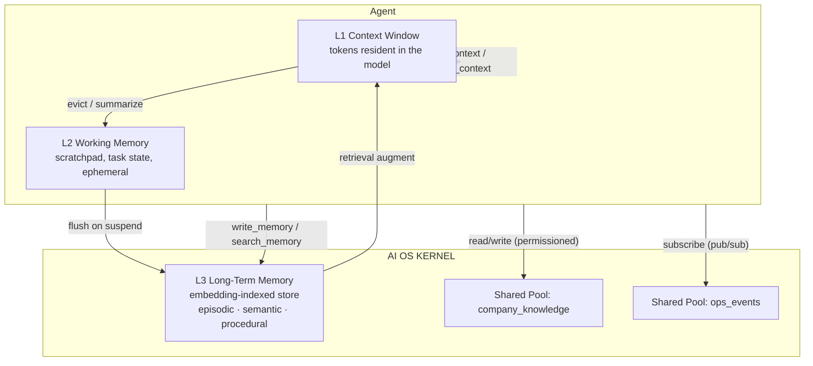

# 04 — Memory Manager

**Status:** Draft (v0.1)
**Relates to:** `02-kernel.md` (syscalls 12–15), `03-scheduler.md` (context switching), `05-storage.md`.

---

## 1. The Memory Hierarchy

Memory in AI OS is tiered, kernel-owned, and never directly managed by agents — agents read and
write through syscalls.

| Tier | Analogy | Contents | Persistence | Managed by |
|---|---|---|---|---|
| **L1 Context Window** | CPU registers/cache | conversation messages, tool results, retrieved knowledge | in-memory; checkpointed | Context Manager |
| **L2 Working Memory** | RAM | agent scratchpad, task state, intermediate reasoning | in-memory; flushed on suspend | Context/Memory Manager |
| **L3 Long-Term Memory** | disk + index | episodic memories, semantic knowledge, procedural skills | persistent (vector store) | Memory Manager |
| **Shared Pools** | shared memory segments | named, permissioned stores multiple agents use | persistent | Memory Manager |

## 2. L1 — Context Window Management (Context Manager)

- **Assembly:** each LLM turn, the Context Manager assembles the window from:
  `system prompt (from spec) → retrieved L3 hits → recent conversation → current turn`.
- **Budgeting:** a per-agent `context_token_budget` (≤ model max) is enforced; assembly *always*
  fits, by construction.
- **Eviction policy (when the window fills):**
  1. Oldest non-pinned tool outputs are evicted first (their content is stored in L3/L2 anyway).
  2. Older conversation turns are **summarized** by a cheap model call (`summarize_context`),
     and the summary replaces them in-window.
  3. Critical facts are promoted to L3 *before* eviction (`promote_on_evict`, default true).
- **Pinning:** agents may pin items (`append_context` with `pin: true`) — e.g. the task brief —
   so they survive summarization.
- **Correctness invariant:** a summarized window must preserve *all* pinned content and the most
  recent N turns verbatim.

## 3. L2 — Working Memory

- A per-agent scratchpad (`working_memory_size` tokens in the spec).
- Agents use it for intermediate state via `write_memory("working", key, value)` — cheap,
  ephemeral, **not** indexed.
- On suspend/checkpoint: L2 is flushed into the checkpoint; on restore it is reloaded as-is.
- On `exit`: L2 is discarded unless the agent explicitly promotes items to L3.

## 4. L3 — Long-Term Memory (RAG)

Three kinds, stored together but tagged:

| Kind | What | Written when |
|---|---|---|
| **Episodic** | "what happened" — past tasks, decisions, outcomes | at task milestones (`checkpoint(label)`, `log`) |
| **Semantic** | "what is known" — facts, summaries, docs, artifacts | agent explicitly `write_memory`, or promoted on eviction |
| **Procedural** | "how to do it" — reusable recipes, tool workflows | agent explicitly stores after a successful multi-step task |

- **Storage:** an embedding-indexed store (vector DB, see `12-tech-stack.md`). Each entry is a
  chunk with: `{namespace, key, value, embedding, tags, created_at, source_pid, ttl?}`.
- **Retrieval:** `search_memory(query, top_k, min_score)` → embedding similarity (+ optional
  keyword hybrid); hits are formatted and injected into L1 on the next assembly.
- **Namespace isolation:** each agent's L3 lives under its namespace (default `agent:<pid>`),
  so agents don't see each other's memories unless granted shared-pool access.
- **TTL & forgetting:** entries may carry a TTL; `forget_memory` deletes by key or by query.

## 5. Shared Memory Pools

- Named, permissioned stores (e.g. `company_knowledge`, `ops_events`) declared in the spec:
  `{ "pool": "...", "access": "read" | "read-write" }`.
- Access is enforced at syscall time by Access Control (deny by default).
- Pools are the substrate for **cooperative knowledge sharing** and for the **semantic file
  system** (`05-storage.md`).

## 6. Memory Lifecycle & Consistency

- Writes are **append-logged then indexed** (WAL pattern): durability before visibility.
- Index updates are asynchronous; `search_memory` may lag writes by ≤ 100 ms (configurable).
- On checkpoint: L1 + L2 are captured; L3/pools are *not* re-copied (they are already durable) —
  only their references are recorded.
- On restore: L1 is rebuilt, L2 reloaded, references re-linked.

## 7. Embedding Strategy

- One embedding model per kernel config (`embedding.model`), default: a local sentence
  transformer (offline-capable, e.g. `BAAI/bge-small-en` class) or an API embedding model —
  decided in `12-tech-stack.md`.
- Vectors are stored in the vector store chosen at deployment; metadata always travels with the
  vector (namespace, tags, source, TTL) so retrieval can filter **before** similarity ranking.
- Cosine similarity; `min_score` is per-deployment calibrated, not hardcoded.

## 8. Open Design Decisions (to resolve at implementation)

1. **Summarizer model** — a cheap local model for `summarize_context` vs. the agent's own model
   (cheaper, but adds a second model dependency).
2. **Hybrid retrieval** — whether v1 `search_memory` fuses keyword (BM25) + vector, or pure
   vector. (Recommend: pure vector in v1, add BM25 if precision requires it.)
3. **Memory size limits** — per-agent and per-pool caps (entries, tokens) to prevent unbounded
   growth; default policy in kernel config.
4. **Cross-agent memory inheritance** — when agent B is spawned by agent A, should B inherit A's
   memory references? (Recommend: no by default; explicit grants only.)